# 开发记录

## 前提条件

- 安装python3运行环境
- 安装开发工具PyCharm
- 能正常使用chatGPT

## 项目简介

writeMore是一款智能写作软件。使用OpenAI提供的api，作为底层的文本生成能力。优化写作场景的使用体验。

项目旨在解决chatGPT生成文章的诸多痛点。

- 文本生成的提示词（prompt）很难构建和复用
- chatGPT的交互体验，不适合写作场景（无法手动修改，难以重写）
- 无法调整模型参数

项目全程使用GPT生成代码，之后由人工测试和调整。以测试GPT编写代码的可能性。

## 项目创建

使用PyCharm新建项目

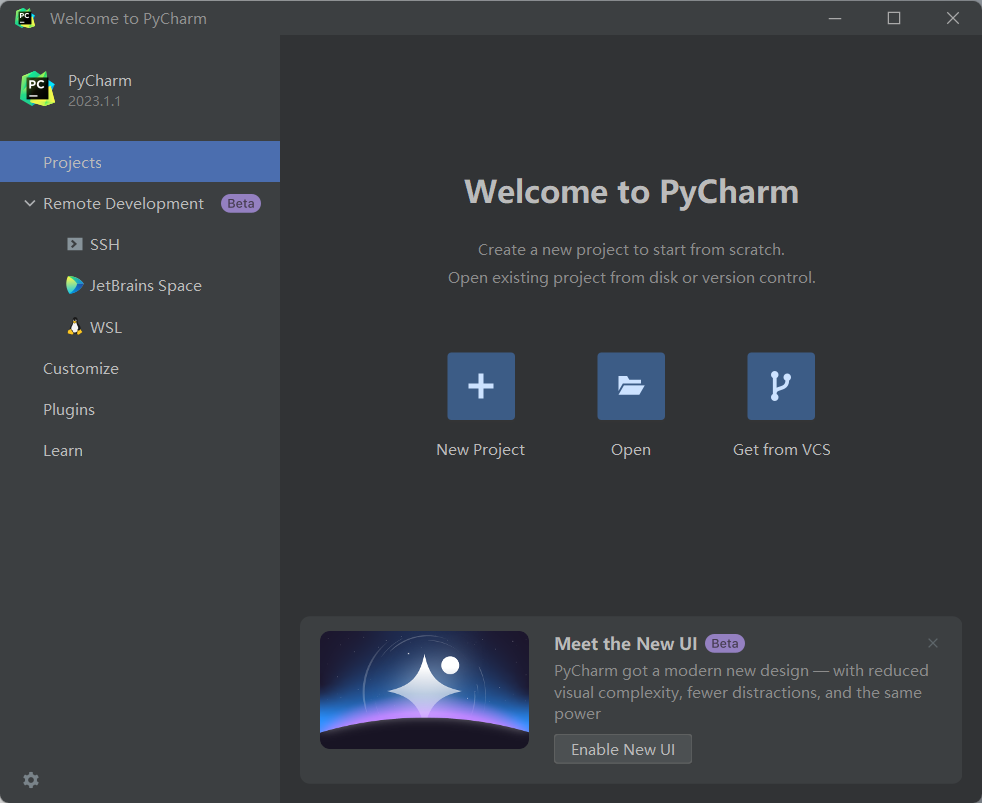

设置项目目录和开发环境

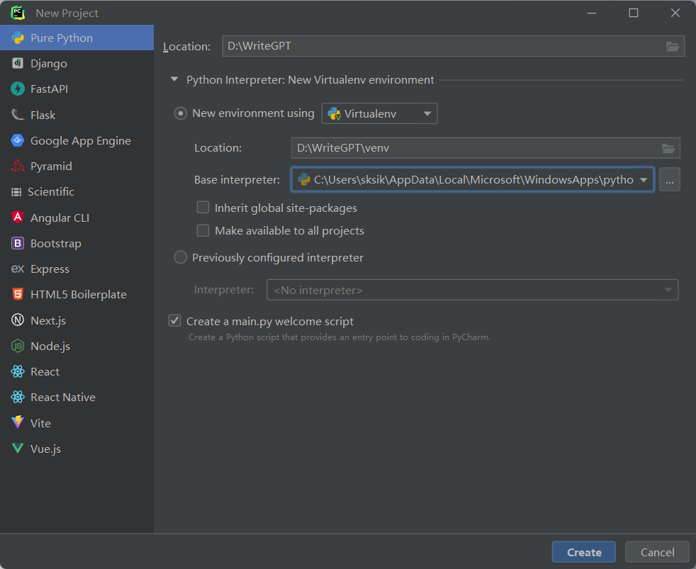

创建完成并测试环境是否正常

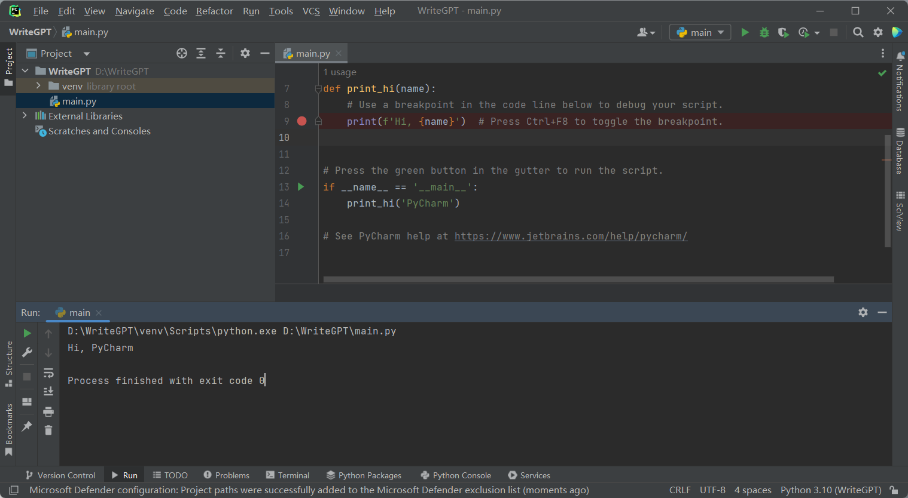

## 使用GPT开发

### 实现基础文本生成功能

> prompt:
>
> 现在，你是一位资深的软件开发工程师，而我是一位产品经理。我会给你提出产品需求，你帮我使用python代码实现。 
>
> 我的第一个需求是： 
>
> 使用python开发一个桌面应用程序。该程序是一款AI写作软件，基于OpenAI提供的api能力，做到输入框输入提示词，点击确认按钮后，后台调用api获取ai生成的文本，然后在另一个文本框输出。 要求使用OpenAI公司提供的python库openai。

> GPT:
>
> 为了实现这个需求，我们可以使用`Tkinter`库创建一个简单的桌面应用程序，结合`openai`库调用OpenAI的API。首先，请确保你已经安装了`openai`库，使用以下命令安装：
>
> ``` shell
> pip install openai
> ```
>
> 接下来，我们将创建一个简单的桌面应用程序，包含一个输入框、一个按钮和一个输出框：
>
> ``` python
> import tkinter as tk
> import openai
> 
> # 配置OpenAI API密钥
> openai.api_key = "your_api_key"
> 
> # 定义一个函数，当点击按钮时调用OpenAI API
> def generate_text():
>     prompt = input_box.get()
>     if prompt.strip() != "":
>         response = openai.Completion.create(
>             engine="davinci-codex",
>             prompt=prompt,
>             max_tokens=100,
>             n=1,
>             stop=None,
>             temperature=0.5,
>         )
>         output_text = response.choices[0].text
>         output_box.delete(1.0, tk.END)
>         output_box.insert(tk.END, output_text)
> 
> # 创建一个Tkinter窗口
> root = tk.Tk()
> root.title("AI写作软件")
> root.geometry("800x600")
> 
> # 创建输入框
> input_box = tk.Entry(root, width=80)
> input_box.pack(pady=10)
> 
> # 创建确认按钮
> confirm_button = tk.Button(root, text="生成文本", command=generate_text)
> confirm_button.pack(pady=10)
> 
> # 创建输出框
> output_box = tk.Text(root, wrap=tk.WORD, width=80, height=20)
> output_box.pack(pady=10)
> 
> # 启动Tkinter事件循环
> root.mainloop()
> 
> ```
>
> 在这段代码中，我们定义了一个`generate_text`函数，该函数从输入框获取提示词并调用OpenAI API生成文本。然后，这个函数将生成的文本插入到输出框中。
>
> 请注意，您需要将`your_api_key`替换为您的实际OpenAI API密钥。此外，您可能需要根据实际情况调整API调用参数，例如引擎、最大令牌数等。
>
> 这个简单的桌面应用程序应该满足您的需求。如果您需要进一步自定义，请随时在此基础上进行修改。

GPT给出的代码中，需要我们手动设置API key

我们可以到[OpenAI官网](https://platform.openai.com/account/api-keys)申请一个key。

将openai.api_key = "your_api_key"的your_api_key替换为自己的api key后，我们尝试执行一下。

初次运行使用，在调用Open AI的接口时失败了

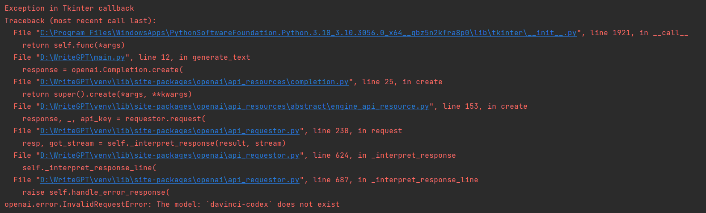

我们将报错信息交给GPT处理一下

> GPT:
> 抱歉给您带来了困扰。看起来问题出在使用的模型名称“davinci-codex”上。请使用有效的模型名称，例如 "text-davinci-002"。请将代码中的以下部分：
>
> ``` python
> response = openai.Completion.create(
>     engine="davinci-codex",
>     prompt=prompt,
>     max_tokens=100,
>     n=1,
>     stop=None,
>     temperature=0.5,
> )
> ```
>
> 替换为：
>
> ``` python
> response = openai.Completion.create(
>     engine="text-davinci-002",
>     prompt=prompt,
>     max_tokens=100,
>     n=1,
>     stop=None,
>     temperature=0.5,
> )
> ```
>
> 更新模型名称后，程序应该可以正常运行。如果您遇到其他问题，请随时告诉我。

GPT指出是模型的名称问题。我们可以根据自己的需要选择具体的模型，模型清单可以访问[官网地址](https://platform.openai.com/docs/models/gpt-3-5)。

在本项目中，我们选择更强大的文本模型`text-davinci-003`。

接下来试试效果

我们使用提示词“写一篇科普文，主题是AI发展历史”作为测试用例

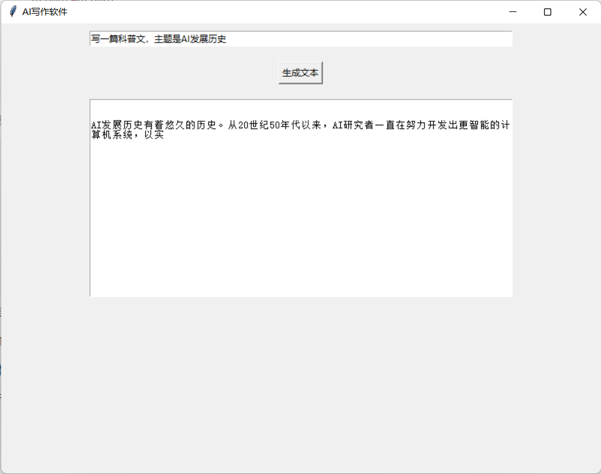

基础的功能已经实现了，但给出的文本内容很少。我们再要求GPT帮我们优化下

> prompt:
> 现在可以正常运行了，但是模型给出的文本内容很少，不是一篇完整的文章，请帮我继续优化，让文章能完整的输出

> GPT:
>
> 我明白您的需求。为了生成更长的文本，我们可以增加`max_tokens`参数的值，同时，我们可以通过调整`temperature`参数来影响生成文本的随机性。数值越小，输出结果越确定性，数值越大，结果越随机。此外，为了确保文章结构的完整性，我们可以在`stop`参数中设置一个终止符，例如句号或者换行符。以下是修改后的`generate_text`函数：
>
> ``` python
> def generate_text():
>     prompt = input_box.get()
>     if prompt.strip() != "":
>         response = openai.Completion.create(
>             engine="text-davinci-002",
>             prompt=prompt,
>             max_tokens=500,  # 增加最大令牌数
>             n=1,
>             stop=["\n"],  # 设置终止符
>             temperature=0.7,  # 调整temperature参数
>         )
>         output_text = response.choices[0].text
>         output_box.delete(1.0, tk.END)
>         output_box.insert(tk.END, output_text)
> ```
>
> 在此示例中，我们将`max_tokens`参数设置为500，这将允许模型生成更长的文本。同时，我们将`temperature`参数调整为0.7，以获得一个适度的随机性。最后，我们将终止符设置为换行符，以确保生成的文章更具完整性。
>
> 请注意，生成更长文本可能会增加API调用的时间。此外，如果您发现生成的文本仍然不够长或太长，可以继续调整`max_tokens`参数。如果您需要进一步优化，请随时告诉我。

GPT告诉我们，可以通过调整max_tokens参数，增加内容输出长度。

我们可以在官网查到，最大的tokens，可以是4096。在这里，我们就不用GPT推荐的500，而直接用4000。

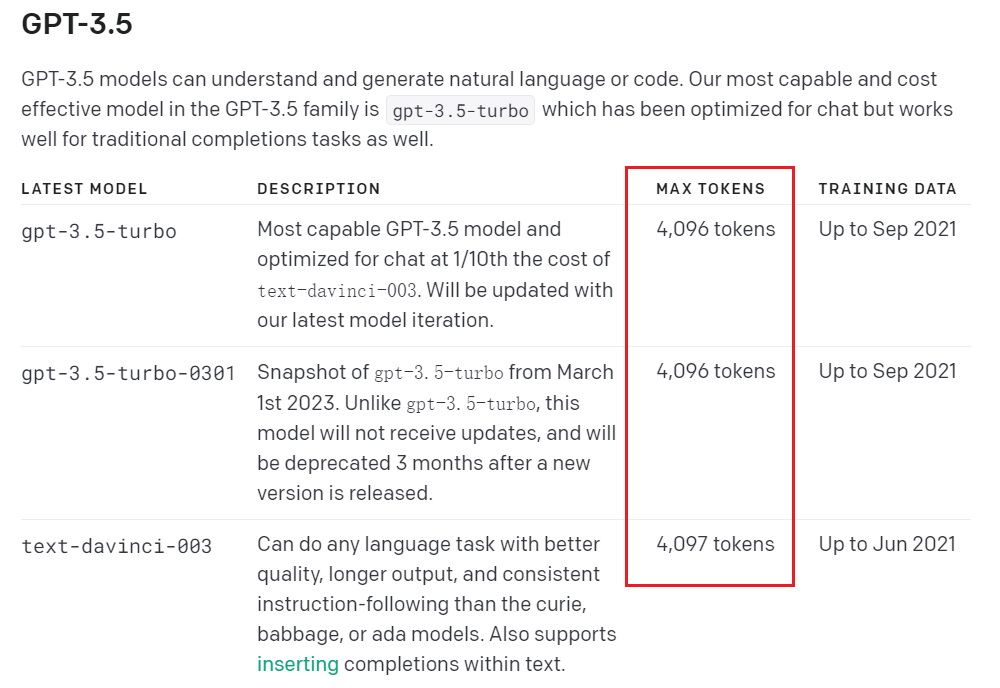

修改后的结果是：

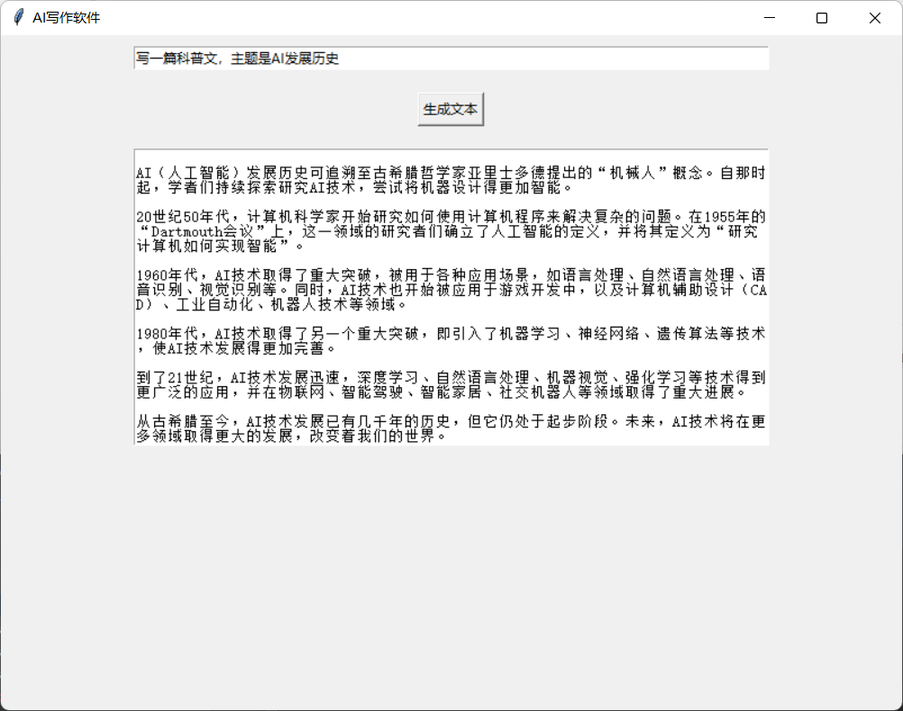

这样基础的文本生成功能就完成了。

### 添加文章修改功能

> Prompt:
>
> 下一个需求是让模型给出的文本可以被修改。
>
>  修改的部分是，用鼠标选中的内容。选中之后，按ctrl+q后，出现一个悬浮框，悬浮框内输入修改意见。点击确认后，将鼠标选中的内容与悬浮框输入的建议，一并通过api传给模型。 
>
> 模型给出结果后，替换鼠标选中的内容。但在替换之前，需要用户确认是否替换。

> GPT:
>
> 为了实现这个需求，我们需要对现有的程序进行一些修改和扩展。首先，我们需要创建一个悬浮框窗口用于输入修改意见。其次，我们需要在输出框的文本被选中并按下Ctrl+K时触发悬浮框。最后，我们需要将选中的内容和修改意见一起传递给模型，并在用户确认后替换选中的内容。
>
> 以下是实现这个功能的代码：
>
> ``` python
> import tkinter as tk
> from tkinter.simpledialog import askstring
> import openai
> 
> openai.api_key = "your_api_key"
> 
> def generate_text():
>     prompt = input_box.get()
>     if prompt.strip() != "":
>         response = openai.Completion.create(
>             engine="text-davinci-002",
>             prompt=prompt,
>             max_tokens=500,
>             n=1,
>             stop=["\n"],
>             temperature=0.7,
>         )
>         output_text = response.choices[0].text
>         output_box.delete(1.0, tk.END)
>         output_box.insert(tk.END, output_text)
> 
> def edit_text(event):
>     if event.state == 4 and event.keysym == 'q':  # 检查是否按下了Ctrl + Q
>         selected_text = output_box.get(tk.SEL_FIRST, tk.SEL_LAST)
>         if selected_text:
>             suggestion = askstring("修改建议", "请输入修改意见：")
>             if suggestion:
>                 prompt = f"{selected_text} -> {suggestion}"
>                 response = openai.Completion.create(
>                     engine="text-davinci-002",
>                     prompt=prompt,
>                     max_tokens=100,
>                     n=1,
>                     stop=None,
>                     temperature=0.7,
>                 )
>                 new_text = response.choices[0].text
>                 if tk.messagebox.askyesno("替换确认", f"原文本：{selected_text}\n新文本：{new_text}\n是否替换？"):
>                     output_box.delete(tk.SEL_FIRST, tk.SEL_LAST)
>                     output_box.insert(tk.INSERT, new_text)
> 
> root = tk.Tk()
> root.title("AI写作软件")
> root.geometry("800x600")
> 
> input_box = tk.Entry(root, width=80)
> input_box.pack(pady=10)
> 
> confirm_button = tk.Button(root, text="生成文本", command=generate_text)
> confirm_button.pack(pady=10)
> 
> output_box = tk.Text(root, wrap=tk.WORD, width=80, height=20)
> output_box.pack(pady=10)
> output_box.bind('<Control-Key>', edit_text)
> 
> root.mainloop()
> 
> ```
>
> 现在，当您在输出框中选中文本并按下Ctrl+K时，将弹出一个悬浮框让您输入修改意见。模型会结合选中的文本和修改意见生成新的文本。在替换选中的内容之前，程序会询问用户是否确认替换。
>
> 请注意，为了使此代码正常工作，您需要确保您的OpenAI API密钥已

代码复制到pycharm中，出现一个问题，ide提示Cannot find reference 'messagebox' in '__init__.pyi' 

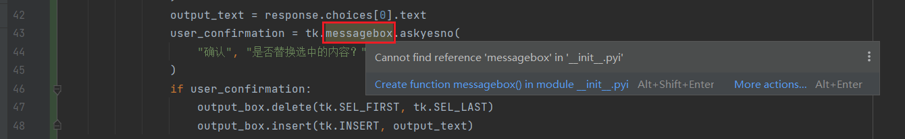

把问题交给GPT

> Prompt: Cannot find reference 'messagebox' in '__init__.pyi' 

> GPT:抱歉，我的失误。我们需要在代码中导入`tkinter.messagebox`。请在代码的开头添加以下导入语句：
>
> ```python
> import tkinter.messagebox
> ```
>
> 现在，程序应该可以正常运行，并且在替换选中的内容之前会弹出确认框。如果您遇到其他问题，请随时告诉我。

开始测试代码：

选中文本之后按ctrl+q，没有任何反应。

这个时候，我们需要确认一下event.state是否正确

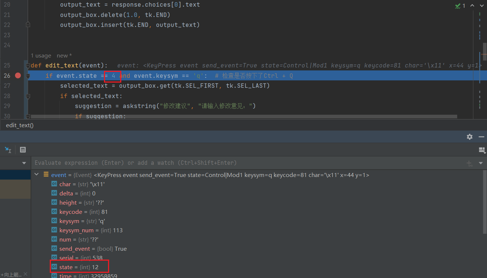

可以看到state是12与GPT给出的4不一致。让GPT解决一下这个问题

> prmpt:使用debug模式，查看按下ctrl+q的event.state，结果是state=12，而不是代码中的4。如何处理

> GPT:
>
> 抱歉给您带来了困扰。`event.state`的值可能因平台和系统而异。在这种情况下，我们可以使用另一种方法来检测Ctrl键是否被按下。我们可以使用`event.keysym`属性检查按键符号，并结合`event.state & 0x4`来检查Ctrl键的状态。以下是修改后的`edit_text`函数定义部分：
>
> ```python
> def edit_text(event):
>     ctrl_pressed = event.state & 0x4  # 检查Ctrl键是否按下
>     if ctrl_pressed and event.keysym == 'q':  # 检查是否按下了Ctrl + Q
>         # ...函数的其余部分保持不变
> ```
>
> 这个修改应该解决了您的问题。现在，按下Ctrl + Q时，`edit_text`函数应该能够正确触发。如果您遇到其他问题，请随时告诉我。

解决了这个问题后，我们再来测试一下。
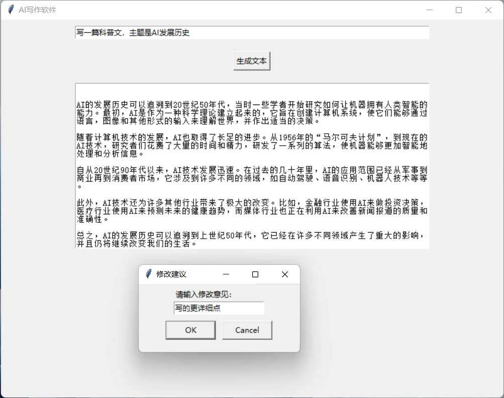

图中选中的是第一段文字，点击ok后，报错了

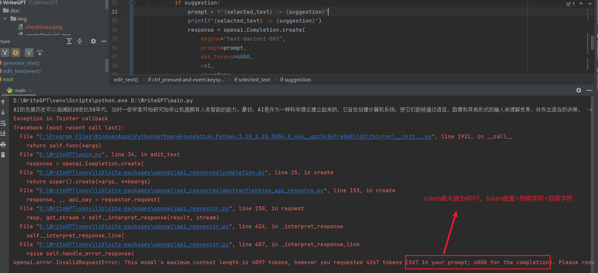

将报错信息给GPT后，得到的回答是，token长度超过限制。

> GPT:
> 抱歉给您带来了困扰。这个错误是因为模型的最大上下文长度限制为4097个令牌，而您的请求超过了这个限制。为了解决这个问题，您可以尝试减少`max_tokens`的值，以保持在模型的上下文长度限制范围内。
>
> 以下是更新后的代码，其中`max_tokens`值已更改为3000。您可以根据需要调整此值，但请确保保持在模型的最大上下文长度限制内：(代码只是将max_tokens改为3000，此处就省略代码)
>
> 这个修改应该解决了您的问题。如果您还有其他问题，请随时告诉我。

这里我们再优化一下，改为动态调整预设的tokens

``` python
response = openai.Completion.create(
    engine="text-davinci-003",
    prompt=prompt,
    max_tokens=4000 - len(prompt),
    n=1,
    stop=None,
    temperature=0.7,
)
```

设置完成后，再次测试

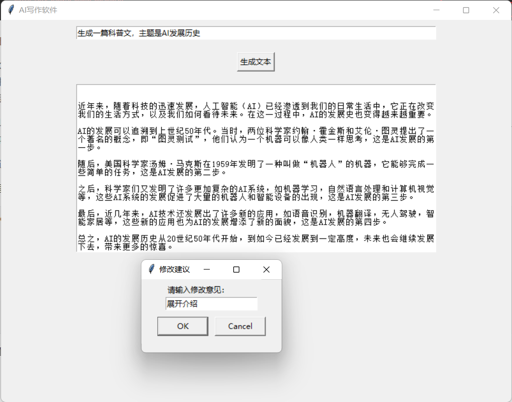

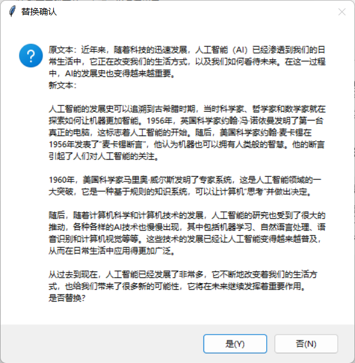

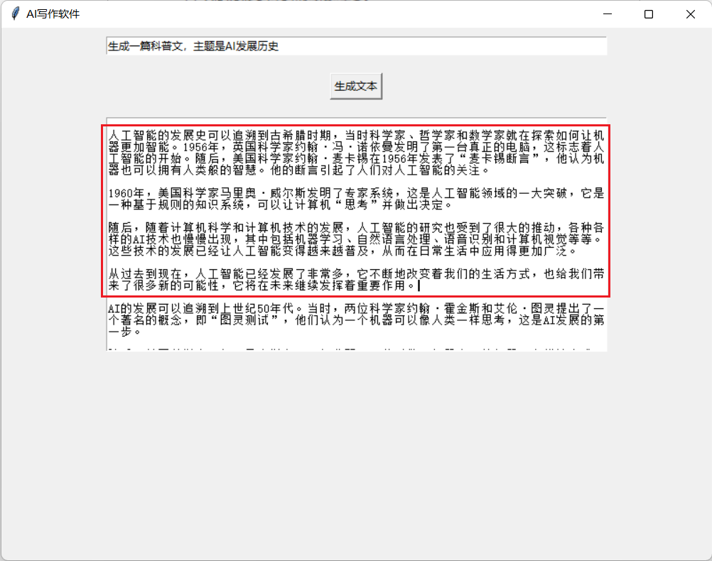

可以看到，文本已经实现了使用GPT修改内容的功能了。
