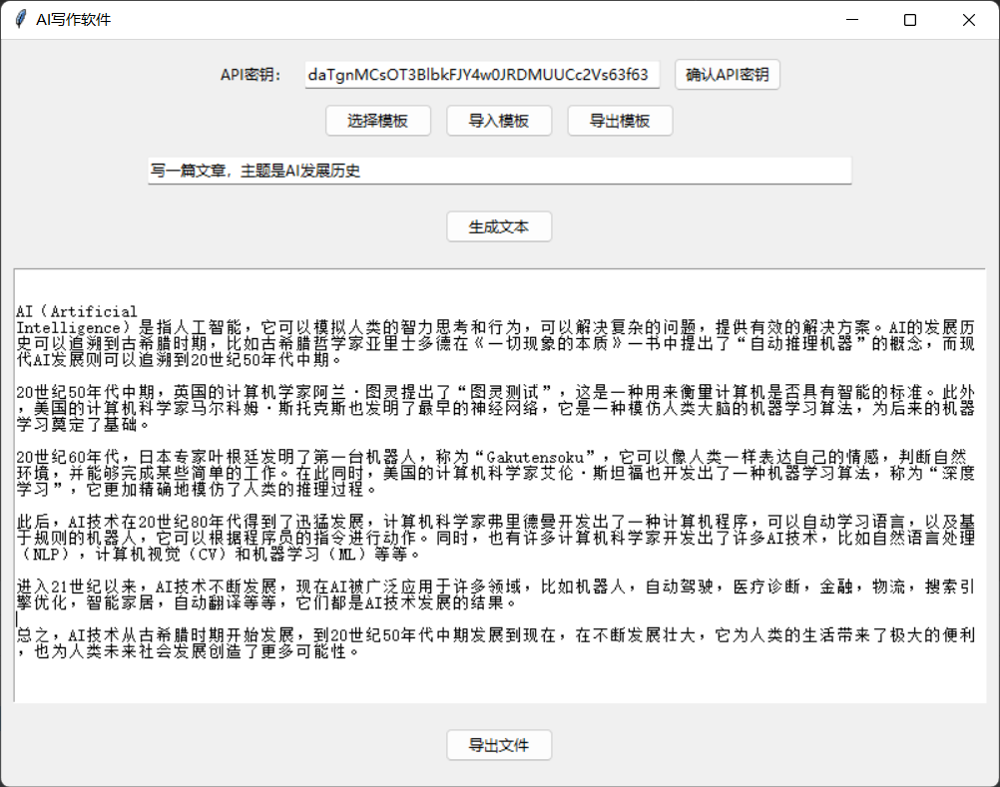

# 使用指南



1. 使用前，需要填写API密钥，填写完成后，点击确认按钮
2. 初始化可以选择使用模板。模板通过.json文件导入，以下是一个示例
   ```json 
   {
       "读后感":"写一篇读后感，书名是{书名}，作者是{作者}，字数是{字数}.{补充说明}"
   }
   ```
3. 输入框中填写好prompt之后，可以点击生成文本请求openai的api获取内容。
4. 内容填充到输出框之后，可以手动修改。也可以选中要修改的内容，按下ctrl+q。给出修改意见，交给AI修改。
5. 文章写完之后，可以将内容导出为word格式。